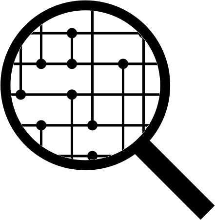

# Sorting Network Search

  

The source code for this sorting network backtracking search is written and maintained by
[Ian Parberry](http://ianparberry.com). See 
[https://ian-parberry.github.io/sortingnetworksearch/](https://ian-parberry.github.io/sortingnetworksearch/)
for documentation.

## Requirements

Windows and Visual C++.
This code has been tested with Visual Studio 2022 Community under Windows 11.

## License

This project is released under the
[MIT License](https://github.com/Ian-Parberry/sortingnetworksearch/blob/master/LICENSE).

